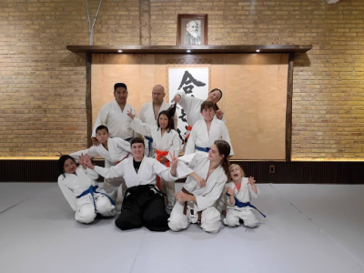
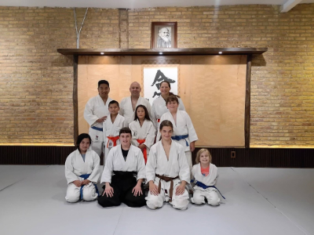

## 5th Kyu - Blue Belt with Three Stripes

### Ki Exercises

[Tenkan Undo](https://www.youtube.com/watch?v=4JxNYHFtuPs)

Shikko

* [Forward and Backward](https://www.youtube.com/watch?v=fWR1JY3emK0)
* [Forward with Spin](https://www.youtube.com/watch?v=kAleKnz08fg)
* [Backward with Spin](https://www.youtube.com/watch?v=NOq2V8tJoDo)

Yoko Ukemi

* [Soft High Breakfall](https://www.youtube.com/watch?v=FX9iJvCNbzU)
* [Sidefall](https://www.youtube.com/watch?v=n4ULJMYH83Y&list=PLeWXsK_rjBy5hDgcGVIHlD1wLr7XJaxgC&index=13)

### Response Techniques

Ryotetori Kokyunage

* [Pivot Throw Version 1](https://www.youtube.com/watch?v=CwdgY0_ijFY)
* [Pivot Throw Version 2](https://www.youtube.com/watch?v=oCOZUe4LLTw)
* [Pivot Throw Version 3](https://www.youtube.com/watch?v=mv2dBE4lUU4)
* [Pivot Throw Version 4](https://www.youtube.com/watch?v=hro0Yx7uMfU&pp=0gcJCU8KAYcqIYzv)
* [Pivot Throw Version 5](https://www.youtube.com/watch?v=UNtvcMQnuV0)
* [Step Back and Kneel](https://www.youtube.com/watch?v=NjHKM5zTFAg)

Ushirohijitori Kotegaeshi

* [First Hand](https://www.youtube.com/watch?v=qa61Lz8RKaY)
* [Second Hand](https://www.youtube.com/shorts/GRZ6KHETaMU)

Munetsuki Kokyunage

* [Version 1](https://www.youtube.com/watch?v=IY4-X24LLOU)
* [Version 2](https://www.youtube.com/watch?v=gRfYcHSn0WE)
* [Version 3](https://www.youtube.com/watch?v=RIIuF5NjMIM)
* [Version 4](https://www.youtube.com/watch?v=d1UWP-dvlDI)
* [Supplemental Version One](https://www.youtube.com/watch?v=_fIHO562mlA)

[Suwariwaza: Shomenuchi Ikkyo](https://www.youtube.com/watch?v=zWVxB3tCjys)

### Belt Testing

Community:

[🌿🌀🎨](https://basil.one)
